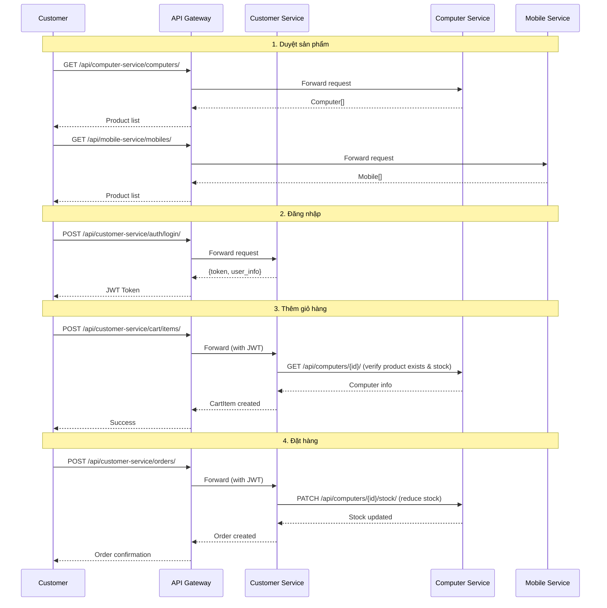
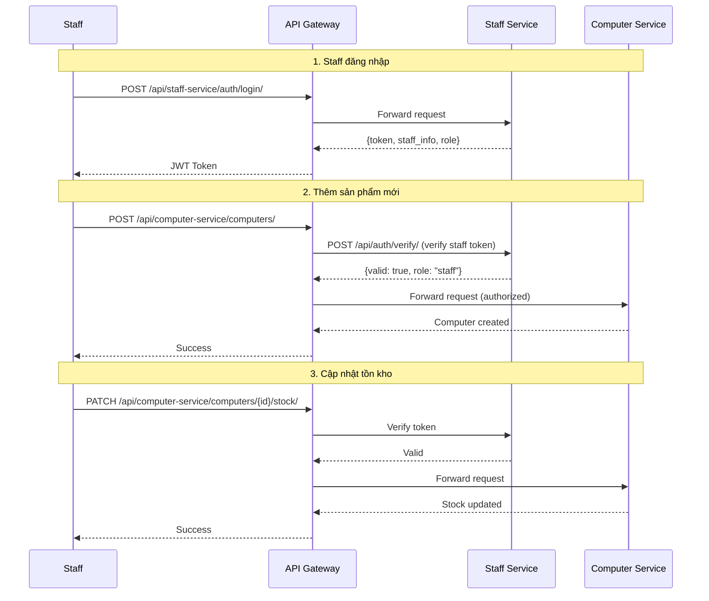

# 📊 Microservices System — Analysis and Design

# Hệ Thống Bán Máy Tính & Điện Thoại (TechStore)

Tài liệu phân tích thiết kế hướng dịch vụ cho hệ thống bán máy tính và điện thoại, xây dựng theo kiến trúc Microservices với Django.

**References:**

---

## 1. 🎯 Problem Statement

- **Domain**: E-commerce — Bán lẻ thiết bị điện tử (máy tính, điện thoại)
- **Problem**: Cần một hệ thống bán hàng trực tuyến cho phép khách hàng duyệt, tìm kiếm, đặt mua máy tính và điện thoại; đồng thời cung cấp giao diện quản trị cho nhân viên và quản lý để vận hành cửa hàng. Hệ thống được xây dựng theo kiến trúc microservices để đảm bảo tính module hóa, dễ mở rộng và bảo trì độc lập từng thành phần.
- **Users/Actors**:

| Actor               | Mô tả                                                                               |
| -------------------- | ------------------------------------------------------------------------------------- |
| **Guest**            | Khách vãng lai — duyệt và xem sản phẩm, không cần đăng nhập                        |
| **Customer**         | Khách hàng đã đăng ký — đăng nhập, thêm giỏ hàng, đặt hàng, đánh giá sản phẩm     |
| **Staff**            | Nhân viên bán hàng — quản lý sản phẩm, đơn hàng, kho hàng, khách hàng              |
| **Admin (Manager)**  | Quản trị viên — quản lý danh mục, kho, thống kê doanh thu, quản lý nhân viên/phân quyền |

- **Scope**:

| In Scope (v1)                                     | Out of Scope (v1)                              |
| -------------------------------------------------- | ----------------------------------------------- |
| Xem danh mục, chi tiết sản phẩm                   | Thanh toán online thật (Momo, VNPay, Stripe...) |
| Tìm kiếm và lọc sản phẩm (giá, thương hiệu, loại) | Tích hợp vận chuyển (GHN, GHTK...)             |
| Đăng ký / Đăng nhập (JWT)                         | Chat hỗ trợ trực tuyến                         |
| Giỏ hàng (thêm, xoá, sửa)                        | Đa ngôn ngữ (i18n)                             |
| Đặt hàng (checkout)                               | Ứng dụng mobile native                         |
| Xem lịch sử đơn hàng                              |                                                 |
| Đánh giá / nhận xét sản phẩm                      |                                                 |
| Quản lý sản phẩm, đơn hàng, kho (Staff)           |                                                 |
| Thống kê doanh thu, quản lý nhân viên (Admin)     |                                                 |

---

## 2. 🧩 Service-Oriented Analysis

### 2.1 Business Process Decomposition

#### Quy trình 1: Mua hàng (Customer)

| Step | Activity                      | Actor    | Description                                                                    |
| ---- | ----------------------------- | -------- | ------------------------------------------------------------------------------ |
| 1    | Duyệt danh mục sản phẩm      | Guest    | Khách truy cập website, xem danh sách máy tính / điện thoại                   |
| 2    | Tìm kiếm / lọc sản phẩm      | Guest    | Lọc theo thương hiệu, giá, loại sản phẩm; tìm kiếm theo tên                  |
| 3    | Xem chi tiết sản phẩm         | Guest    | Xem thông số kỹ thuật, mô tả, ảnh, đánh giá                                  |
| 4    | Đăng ký / Đăng nhập           | Customer | Tạo tài khoản hoặc đăng nhập để mua hàng                                      |
| 5    | Thêm sản phẩm vào giỏ hàng   | Customer | Chọn sản phẩm, số lượng và thêm vào giỏ                                       |
| 6    | Quản lý giỏ hàng              | Customer | Xem, sửa số lượng, xoá sản phẩm trong giỏ                                    |
| 7    | Đặt hàng (Checkout)           | Customer | Nhập thông tin giao hàng, xác nhận đơn hàng                                   |
| 8    | Xem lịch sử đơn hàng          | Customer | Theo dõi trạng thái đơn hàng đã đặt                                           |
| 9    | Đánh giá sản phẩm             | Customer | Viết nhận xét và đánh giá sao cho sản phẩm đã mua                             |

#### Quy trình 2: Quản lý sản phẩm (Staff)

| Step | Activity                        | Actor | Description                                                           |
| ---- | ------------------------------- | ----- | --------------------------------------------------------------------- |
| 1    | Đăng nhập hệ thống quản trị    | Staff | Nhân viên đăng nhập vào giao diện admin                               |
| 2    | Thêm sản phẩm mới              | Staff | Nhập thông tin sản phẩm (tên, giá, cấu hình, ảnh...)                 |
| 3    | Cập nhật thông tin sản phẩm     | Staff | Sửa giá, mô tả, cấu hình, trạng thái sản phẩm                       |
| 4    | Xoá sản phẩm                   | Staff | Xoá sản phẩm khỏi hệ thống (soft delete hoặc hard delete)            |
| 5    | Quản lý danh mục                | Staff | Thêm, sửa, xoá danh mục sản phẩm                                    |
| 6    | Quản lý tồn kho                 | Staff | Cập nhật số lượng tồn kho cho từng sản phẩm                          |

#### Quy trình 3: Xử lý đơn hàng (Staff)

| Step | Activity                       | Actor | Description                                                    |
| ---- | ------------------------------ | ----- | -------------------------------------------------------------- |
| 1    | Xem danh sách đơn hàng mới    | Staff | Xem các đơn hàng mới cần xử lý                                |
| 2    | Xác nhận đơn hàng              | Staff | Kiểm tra tồn kho và xác nhận đơn hàng                         |
| 3    | Cập nhật trạng thái đơn hàng   | Staff | Chuyển trạng thái: Chờ xử lý → Đã xác nhận → Đang giao → Hoàn thành |
| 4    | Quản lý khách hàng             | Staff | Xem thông tin khách hàng, lịch sử mua hàng                    |

#### Quy trình 4: Quản trị hệ thống (Admin/Manager)

| Step | Activity                    | Actor | Description                                                  |
| ---- | --------------------------- | ----- | ------------------------------------------------------------ |
| 1    | Quản lý nhân viên           | Admin | Thêm, sửa, phân quyền nhân viên                             |
| 2    | Quản lý danh mục sản phẩm  | Admin | Tổ chức lại cây danh mục sản phẩm                           |
| 3    | Quản lý kho hàng            | Admin | Giám sát tồn kho tổng thể                                   |
| 4    | Thống kê doanh thu          | Admin | Xem báo cáo doanh thu theo ngày/tháng/năm                   |

### 2.2 Entity Identification

| Entity           | Attributes                                                                                   | Owned By          |
| ---------------- | -------------------------------------------------------------------------------------------- | ----------------- |
| **Staff**        | id, username, password, full_name, email, phone, role (staff/admin), is_active, created_at    | Staff Service     |
| **Customer**     | id, username, password, full_name, email, phone, address, created_at                         | Customer Service  |
| **Cart**         | id, customer_id, created_at, updated_at                                                      | Customer Service  |
| **CartItem**     | id, cart_id, product_id, product_type (computer/mobile), quantity, price                     | Customer Service  |
| **Order**        | id, customer_id, total_amount, status, shipping_address, phone, note, created_at             | Customer Service  |
| **OrderItem**    | id, order_id, product_id, product_type, product_name, quantity, price                        | Customer Service  |
| **Review**       | id, customer_id, product_id, product_type, rating, comment, created_at                       | Customer Service  |
| **Computer**     | id, name, brand, price, description, image, stock, status, category_id                       | Computer Service  |
| **ComputerSpec** | id, computer_id, cpu, ram, storage, gpu, screen_size, os                                     | Computer Service  |
| **ComputerCategory** | id, name, description                                                                   | Computer Service  |
| **Mobile**       | id, name, brand, price, description, image, stock, status, category_id                       | Mobile Service    |
| **MobileSpec**   | id, mobile_id, screen_size, battery, camera, storage, ram, os                                | Mobile Service    |
| **MobileCategory** | id, name, description                                                                     | Mobile Service    |

### 2.3 Service Candidate Identification

Dựa trên yêu cầu giảng viên và phân tích bounded context:

| Service              | Bounded Context          | Lý do tách riêng                                                      |
| -------------------- | ------------------------ | ---------------------------------------------------------------------- |
| **Staff Service**    | Staff Management         | Quản lý thông tin nhân viên, xác thực staff/admin, phân quyền         |
| **Customer Service** | Customer & Order         | Quản lý khách hàng, giỏ hàng, đơn hàng, đánh giá — domain của người mua |
| **Computer Service** | Computer Product Catalog | Quản lý sản phẩm máy tính, danh mục, specs — domain riêng biệt        |
| **Mobile Service**   | Mobile Product Catalog   | Quản lý sản phẩm điện thoại, danh mục, specs — domain riêng biệt      |
| **API Gateway**      | Cross-cutting            | Routing, xác thực JWT, điểm truy cập duy nhất cho frontend            |

---

## 3. 🔄 Service-Oriented Design

### 3.1 Service Inventory

| Service              | Responsibility                                                     | Type   | Tech Stack            | Port  | Database   |
| -------------------- | ------------------------------------------------------------------ | ------ | --------------------- | ----- | ---------- |
| **API Gateway**      | Routing, JWT verification, request forwarding                      | Utility | Django                | 8000  | —          |
| **Staff Service**    | Quản lý nhân viên, xác thực staff/admin, phân quyền               | Entity | Django + DRF          | 8001  | MySQL      |
| **Customer Service** | Quản lý khách hàng, giỏ hàng, đơn hàng, đánh giá                  | Entity | Django + DRF          | 8002  | MySQL      |
| **Computer Service** | CRUD máy tính, danh mục, specs, tồn kho máy tính                  | Entity | Django + DRF          | 8003  | PostgreSQL |
| **Mobile Service**   | CRUD điện thoại, danh mục, specs, tồn kho điện thoại              | Entity | Django + DRF          | 8004  | PostgreSQL |
| **Frontend**         | Giao diện web (Customer view + Staff/Admin view)                   | UI     | Django Templates      | 8080  | —          |

### 3.2 Service Capabilities (Interface Design)

#### Staff Service (port 8001)

| Capability                  | Method | Endpoint                    | Input                  | Output              |
| --------------------------- | ------ | --------------------------- | ---------------------- | -------------------- |
| Đăng nhập staff             | POST   | `/api/auth/login/`          | {username, password}   | {token, user_info}   |
| Đăng ký staff (Admin only)  | POST   | `/api/staff/`               | StaffCreate body       | Staff                |
| Danh sách staff              | GET    | `/api/staff/`               | query params (role)    | Staff[]              |
| Chi tiết staff               | GET    | `/api/staff/{id}/`          | —                      | Staff                |
| Cập nhật staff               | PUT    | `/api/staff/{id}/`          | StaffUpdate body       | Staff                |
| Xoá staff                   | DELETE | `/api/staff/{id}/`          | —                      | 204                  |
| Xác thực token              | POST   | `/api/auth/verify/`         | {token}                | {valid, user_info}   |
| Health check                | GET    | `/health`                   | —                      | {status: "ok"}       |

#### Customer Service (port 8002)

| Capability                     | Method | Endpoint                           | Input                    | Output              |
| ------------------------------ | ------ | ----------------------------------- | ------------------------ | -------------------- |
| Đăng ký khách hàng             | POST   | `/api/auth/register/`              | CustomerCreate body      | Customer             |
| Đăng nhập khách hàng           | POST   | `/api/auth/login/`                 | {username, password}     | {token, user_info}   |
| Thông tin khách hàng           | GET    | `/api/customers/me/`               | —                        | Customer             |
| Cập nhật thông tin             | PUT    | `/api/customers/me/`               | CustomerUpdate body      | Customer             |
| Danh sách khách hàng (Staff)   | GET    | `/api/customers/`                  | query params             | Customer[]           |
| Xem giỏ hàng                  | GET    | `/api/cart/`                       | —                        | Cart + CartItem[]    |
| Thêm vào giỏ                  | POST   | `/api/cart/items/`                 | {product_id, product_type, qty} | CartItem      |
| Cập nhật số lượng              | PUT    | `/api/cart/items/{id}/`            | {quantity}               | CartItem             |
| Xoá khỏi giỏ                  | DELETE | `/api/cart/items/{id}/`            | —                        | 204                  |
| Tạo đơn hàng                  | POST   | `/api/orders/`                     | OrderCreate body         | Order                |
| Danh sách đơn hàng            | GET    | `/api/orders/`                     | query params (status)    | Order[]              |
| Chi tiết đơn hàng             | GET    | `/api/orders/{id}/`                | —                        | Order + OrderItem[]  |
| Cập nhật trạng thái (Staff)   | PATCH  | `/api/orders/{id}/status/`         | {status}                 | Order                |
| Tạo đánh giá                  | POST   | `/api/reviews/`                    | ReviewCreate body        | Review               |
| Đánh giá theo sản phẩm        | GET    | `/api/reviews/`                    | ?product_id&product_type | Review[]             |
| Health check                  | GET    | `/health`                          | —                        | {status: "ok"}       |

#### Computer Service (port 8003)

| Capability                  | Method | Endpoint                          | Input                   | Output               |
| --------------------------- | ------ | --------------------------------- | ----------------------- | ---------------------- |
| Danh sách máy tính          | GET    | `/api/computers/`                 | query params (search, brand, category, price_min, price_max) | Computer[] |
| Chi tiết máy tính           | GET    | `/api/computers/{id}/`            | —                       | Computer + Spec        |
| Tạo máy tính (Staff)        | POST   | `/api/computers/`                 | ComputerCreate body     | Computer               |
| Cập nhật máy tính (Staff)   | PUT    | `/api/computers/{id}/`            | ComputerUpdate body     | Computer               |
| Xoá máy tính (Staff)        | DELETE | `/api/computers/{id}/`            | —                       | 204                    |
| Cập nhật tồn kho (Staff)    | PATCH  | `/api/computers/{id}/stock/`      | {stock}                 | Computer               |
| Danh mục máy tính           | GET    | `/api/categories/`                | —                       | Category[]             |
| CRUD danh mục (Staff)       | POST/PUT/DELETE | `/api/categories/`/`{id}/` | Category body         | Category               |
| Health check                | GET    | `/health`                         | —                       | {status: "ok"}         |

#### Mobile Service (port 8004)

| Capability                  | Method | Endpoint                          | Input                   | Output               |
| --------------------------- | ------ | --------------------------------- | ----------------------- | ---------------------- |
| Danh sách điện thoại        | GET    | `/api/mobiles/`                   | query params (search, brand, category, price_min, price_max) | Mobile[] |
| Chi tiết điện thoại         | GET    | `/api/mobiles/{id}/`              | —                       | Mobile + Spec          |
| Tạo điện thoại (Staff)      | POST   | `/api/mobiles/`                   | MobileCreate body       | Mobile                 |
| Cập nhật điện thoại (Staff) | PUT    | `/api/mobiles/{id}/`              | MobileUpdate body       | Mobile                 |
| Xoá điện thoại (Staff)      | DELETE | `/api/mobiles/{id}/`              | —                       | 204                    |
| Cập nhật tồn kho (Staff)    | PATCH  | `/api/mobiles/{id}/stock/`        | {stock}                 | Mobile                 |
| Danh mục điện thoại         | GET    | `/api/categories/`                | —                       | Category[]             |
| CRUD danh mục (Staff)       | POST/PUT/DELETE | `/api/categories/`/`{id}/` | Category body         | Category               |
| Health check                | GET    | `/health`                         | —                       | {status: "ok"}         |

#### API Gateway (port 8000)

| Capability                | Method | Endpoint                         | Forward To         |
| ------------------------- | ------ | -------------------------------- | ------------------- |
| Staff auth routes         | *      | `/api/staff-service/**`          | Staff Service       |
| Customer auth routes      | *      | `/api/customer-service/**`       | Customer Service    |
| Computer product routes   | *      | `/api/computer-service/**`       | Computer Service    |
| Mobile product routes     | *      | `/api/mobile-service/**`         | Mobile Service      |
| Health check              | GET    | `/health`                        | —                   |

### 3.3 Service Interactions

#### Quy trình mua hàng (Customer Flow)



#### Quy trình quản lý sản phẩm (Staff Flow)



### 3.4 Data Ownership & Boundaries

| Data Entity       | Owner Service    | Access Pattern                                           |
| ------------------ | ---------------- | -------------------------------------------------------- |
| Staff              | Staff Service    | CRUD via REST API (Admin only)                           |
| Customer           | Customer Service | CRUD via REST API (self + staff view)                    |
| Cart, CartItem     | Customer Service | CRUD via REST API (customer only)                        |
| Order, OrderItem   | Customer Service | Create (customer), Read/Update status (staff)            |
| Review             | Customer Service | Create (customer), Read (public)                         |
| Computer, Spec     | Computer Service | CRUD via REST API (staff), Read (public)                 |
| ComputerCategory   | Computer Service | CRUD via REST API (staff/admin), Read (public)           |
| Mobile, Spec       | Mobile Service   | CRUD via REST API (staff), Read (public)                 |
| MobileCategory     | Mobile Service   | CRUD via REST API (staff/admin), Read (public)           |

> **Nguyên tắc**: Mỗi service chỉ truy cập database của chính nó. Khi cần dữ liệu từ service khác, gọi qua REST API.

---

## 4. 📋 API Specifications

Các API spec đầy đủ (OpenAPI 3.0) được lưu tại:

- [`docs/api-specs/staff-service.yaml`](api-specs/staff-service.yaml)
- [`docs/api-specs/customer-service.yaml`](api-specs/customer-service.yaml)
- [`docs/api-specs/computer-service.yaml`](api-specs/computer-service.yaml)
- [`docs/api-specs/mobile-service.yaml`](api-specs/mobile-service.yaml)
- [`docs/api-specs/gateway.yaml`](api-specs/gateway.yaml)

---

## 5. 🗄️ Data Model

### Staff Service — Data Model (MySQL)

```
┌─────────────────────────┐
│         Staff           │
├─────────────────────────┤
│ id: INT (PK, AUTO)      │
│ username: VARCHAR(150)   │
│ password: VARCHAR(128)   │
│ full_name: VARCHAR(255)  │
│ email: VARCHAR(254)      │
│ phone: VARCHAR(20)       │
│ role: ENUM(staff, admin) │
│ is_active: BOOLEAN       │
│ created_at: DATETIME     │
│ updated_at: DATETIME     │
└─────────────────────────┘
```

### Customer Service — Data Model (MySQL)

```
┌──────────────────────────┐       ┌───────────────────────────┐
│        Customer          │       │           Cart            │
├──────────────────────────┤       ├───────────────────────────┤
│ id: INT (PK, AUTO)       │       │ id: INT (PK, AUTO)        │
│ username: VARCHAR(150)   │──1:1──│ customer_id: INT (FK, UQ) │
│ password: VARCHAR(128)   │       │ created_at: DATETIME      │
│ full_name: VARCHAR(255)  │       │ updated_at: DATETIME      │
│ email: VARCHAR(254)      │       └───────────────────────────┘
│ phone: VARCHAR(20)       │                    │ 1:N
│ address: TEXT            │       ┌───────────────────────────┐
│ created_at: DATETIME     │       │         CartItem          │
│ updated_at: DATETIME     │       ├───────────────────────────┤
└──────────────────────────┘       │ id: INT (PK, AUTO)        │
         │ 1:N                     │ cart_id: INT (FK)          │
┌──────────────────────────┐       │ product_id: INT           │
│          Order           │       │ product_type: ENUM        │
├──────────────────────────┤       │   (computer, mobile)      │
│ id: INT (PK, AUTO)       │       │ quantity: INT             │
│ customer_id: INT (FK)    │       │ price: DECIMAL(12,2)      │
│ total_amount: DECIMAL    │       └───────────────────────────┘
│ status: ENUM             │
│   (pending, confirmed,   │
│    shipping, completed,  │
│    cancelled)            │
│ shipping_address: TEXT   │
│ phone: VARCHAR(20)       │
│ note: TEXT               │
│ created_at: DATETIME     │
│ updated_at: DATETIME     │
└──────────────────────────┘
         │ 1:N
┌──────────────────────────┐       ┌───────────────────────────┐
│        OrderItem         │       │          Review           │
├──────────────────────────┤       ├───────────────────────────┤
│ id: INT (PK, AUTO)       │       │ id: INT (PK, AUTO)        │
│ order_id: INT (FK)       │       │ customer_id: INT (FK)     │
│ product_id: INT          │       │ product_id: INT           │
│ product_type: ENUM       │       │ product_type: ENUM        │
│ product_name: VARCHAR    │       │   (computer, mobile)      │
│ quantity: INT            │       │ rating: INT (1-5)         │
│ price: DECIMAL(12,2)     │       │ comment: TEXT             │
└──────────────────────────┘       │ created_at: DATETIME      │
                                   └───────────────────────────┘
```

### Computer Service — Data Model (PostgreSQL)

```
┌───────────────────────────┐       ┌───────────────────────────┐
│     ComputerCategory      │       │         Computer          │
├───────────────────────────┤       ├───────────────────────────┤
│ id: SERIAL (PK)           │       │ id: SERIAL (PK)           │
│ name: VARCHAR(100)        │──1:N──│ name: VARCHAR(255)        │
│ description: TEXT         │       │ brand: VARCHAR(100)       │
└───────────────────────────┘       │ price: DECIMAL(12,2)      │
                                    │ description: TEXT         │
                                    │ image: VARCHAR(500)       │
                                    │ stock: INT                │
                                    │ status: VARCHAR(20)       │
                                    │   (available, unavailable)│
                                    │ category_id: INT (FK)     │
                                    │ created_at: TIMESTAMP     │
                                    │ updated_at: TIMESTAMP     │
                                    └───────────────────────────┘
                                                │ 1:1
                                    ┌───────────────────────────┐
                                    │      ComputerSpec         │
                                    ├───────────────────────────┤
                                    │ id: SERIAL (PK)           │
                                    │ computer_id: INT (FK, UQ) │
                                    │ cpu: VARCHAR(100)         │
                                    │ ram: VARCHAR(50)          │
                                    │ storage: VARCHAR(100)     │
                                    │ gpu: VARCHAR(100)         │
                                    │ screen_size: VARCHAR(20)  │
                                    │ os: VARCHAR(50)           │
                                    └───────────────────────────┘
```

### Mobile Service — Data Model (PostgreSQL)

```
┌───────────────────────────┐       ┌───────────────────────────┐
│      MobileCategory       │       │          Mobile           │
├───────────────────────────┤       ├───────────────────────────┤
│ id: SERIAL (PK)           │       │ id: SERIAL (PK)           │
│ name: VARCHAR(100)        │──1:N──│ name: VARCHAR(255)        │
│ description: TEXT         │       │ brand: VARCHAR(100)       │
└───────────────────────────┘       │ price: DECIMAL(12,2)      │
                                    │ description: TEXT         │
                                    │ image: VARCHAR(500)       │
                                    │ stock: INT                │
                                    │ status: VARCHAR(20)       │
                                    │   (available, unavailable)│
                                    │ category_id: INT (FK)     │
                                    │ created_at: TIMESTAMP     │
                                    │ updated_at: TIMESTAMP     │
                                    └───────────────────────────┘
                                                │ 1:1
                                    ┌───────────────────────────┐
                                    │       MobileSpec          │
                                    ├───────────────────────────┤
                                    │ id: SERIAL (PK)           │
                                    │ mobile_id: INT (FK, UQ)   │
                                    │ screen_size: VARCHAR(20)  │
                                    │ battery: VARCHAR(50)      │
                                    │ camera: VARCHAR(100)      │
                                    │ storage: VARCHAR(50)      │
                                    │ ram: VARCHAR(50)          │
                                    │ os: VARCHAR(50)           │
                                    └───────────────────────────┘
```

---

## 6. ❗ Non-Functional Requirements

| Requirement      | Description                                                                          |
| ---------------- | ------------------------------------------------------------------------------------ |
| **Performance**  | Response time < 500ms cho các API endpoint                                           |
| **Scalability**  | Mỗi service có thể scale độc lập qua Docker                                         |
| **Availability** | Health check endpoint (`/health`) cho mỗi service; tự động restart khi fail          |
| **Security**     | JWT authentication, HTTPS-ready, input validation, không hardcode secrets            |
| **Data Isolation**| Mỗi service sở hữu database riêng, không truy cập trực tiếp DB của service khác    |
| **Deployment**   | Toàn bộ hệ thống khởi chạy bằng `docker compose up --build`                         |
| **Technology**   | Django + Django REST Framework, MySQL + PostgreSQL, Docker Compose                    |
