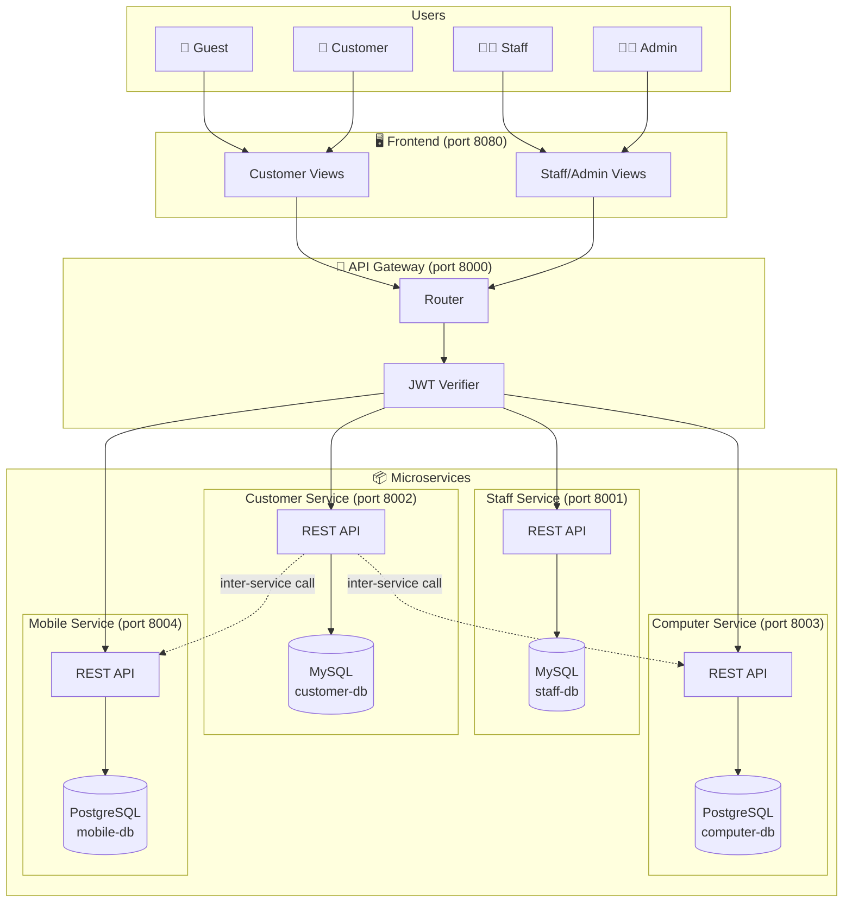
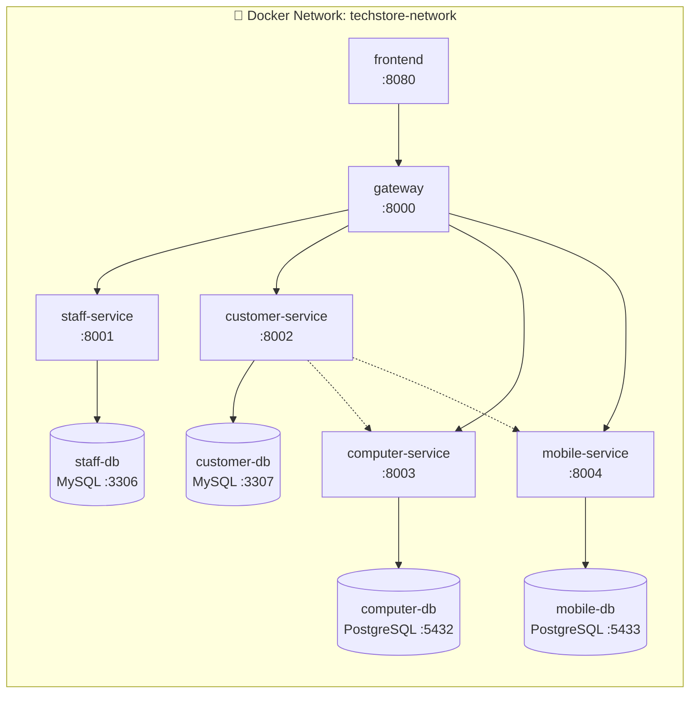
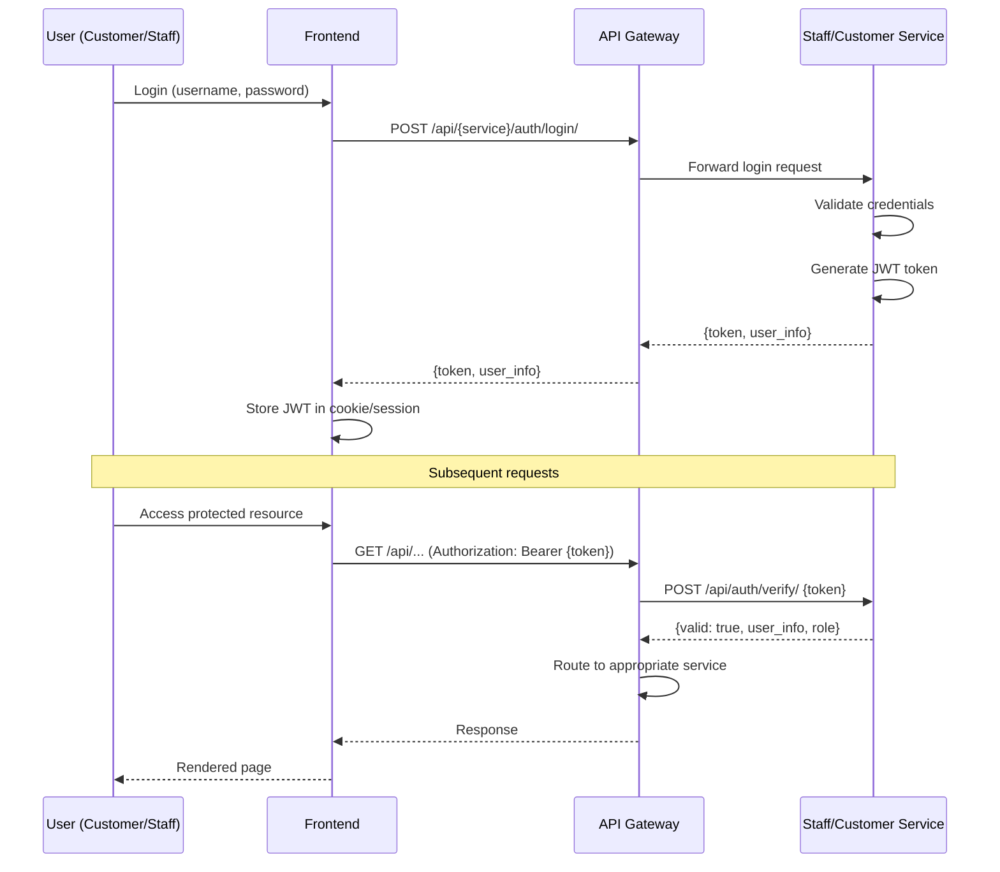

# 🏗️ System Architecture — TechStore

## 1. Overview

**TechStore** là hệ thống bán máy tính và điện thoại trực tuyến, xây dựng theo kiến trúc **Microservices** với Django.

- **Mục tiêu**: Cung cấp nền tảng e-commerce cho phép khách hàng duyệt, tìm kiếm, đặt mua sản phẩm công nghệ; nhân viên và quản trị viên vận hành cửa hàng qua giao diện riêng.
- **Đối tượng**: Guest, Customer, Staff, Admin
- **Quality Attributes**: Module hóa cao, mỗi service phát triển & deploy độc lập, database-per-service, dễ mở rộng.

---

## 2. Architecture Style

- [x] Microservices
- [x] API Gateway pattern
- [ ] Event-driven / Message queue
- [ ] CQRS / Event Sourcing
- [x] Database per service
- [ ] Saga pattern
- [x] RESTful API communication

---

## 3. System Components

| Component            | Responsibility                                       | Tech Stack                 | Port  | Database   |
| -------------------- | ---------------------------------------------------- | -------------------------- | ----- | ---------- |
| **Frontend**         | Giao diện web (Customer + Staff/Admin views)         | Django Templates           | 8080  | —          |
| **API Gateway**      | Routing, JWT verification, request forwarding        | Django                     | 8000  | —          |
| **Staff Service**    | Quản lý nhân viên, xác thực staff/admin, phân quyền | Django + DRF               | 8001  | MySQL      |
| **Customer Service** | Quản lý khách hàng, giỏ hàng, đơn hàng, đánh giá   | Django + DRF               | 8002  | MySQL      |
| **Computer Service** | CRUD máy tính, danh mục, cấu hình, tồn kho          | Django + DRF               | 8003  | PostgreSQL |
| **Mobile Service**   | CRUD điện thoại, danh mục, cấu hình, tồn kho        | Django + DRF               | 8004  | PostgreSQL |
| **staff-db**         | Database cho Staff Service                           | MySQL 8.0                  | 3306  | —          |
| **customer-db**      | Database cho Customer Service                        | MySQL 8.0                  | 3307  | —          |
| **computer-db**      | Database cho Computer Service                        | PostgreSQL 15              | 5432  | —          |
| **mobile-db**        | Database cho Mobile Service                          | PostgreSQL 15              | 5433  | —          |

---

## 4. Communication Patterns

### Synchronous (REST API)

Tất cả giao tiếp giữa các service đều qua **REST API** (đồng bộ). Không sử dụng message queue ở phiên bản v1.

- **Frontend → Gateway**: HTTP REST (Django Templates gọi Gateway endpoints)
- **Gateway → Services**: HTTP REST (forward request + JWT verification)
- **Service → Service**: HTTP REST (khi cần dữ liệu cross-service, VD: Customer Service gọi Computer Service để kiểm tra tồn kho)

### Service Discovery

Sử dụng **Docker Compose DNS** — các service gọi nhau bằng tên service (VD: `http://staff-service:8001`), không dùng localhost.

### Inter-service Communication Matrix

| From ↓ \ To →       | API Gateway | Staff Service | Customer Service | Computer Service | Mobile Service |
| -------------------- | ----------- | ------------- | ---------------- | ---------------- | -------------- |
| **Frontend**         | REST        | —             | —                | —                | —              |
| **API Gateway**      | —           | REST          | REST             | REST             | REST           |
| **Staff Service**    | —           | —             | —                | —                | —              |
| **Customer Service** | —           | —             | —                | REST *(1)*       | REST *(1)*     |
| **Computer Service** | —           | —             | —                | —                | —              |
| **Mobile Service**   | —           | —             | —                | —                | —              |

> *(1)* Customer Service gọi Computer/Mobile Service khi cần kiểm tra sản phẩm tồn tại, kiểm tra tồn kho, hoặc trừ tồn kho khi đặt hàng.

---

## 5. Data Flow

### 5.1 Customer mua hàng

```
Customer → Frontend → Gateway → Computer Service → computer-db (PostgreSQL)
                              → Mobile Service   → mobile-db (PostgreSQL)
                              → Customer Service  → customer-db (MySQL)
```

### 5.2 Staff quản lý sản phẩm

```
Staff → Frontend → Gateway → Staff Service (verify token) → staff-db (MySQL)
                            → Computer Service (CRUD)      → computer-db (PostgreSQL)
                            → Mobile Service (CRUD)        → mobile-db (PostgreSQL)
```

### 5.3 Request Flow chi tiết — Đặt hàng

```
1. Customer → Frontend:     Click "Đặt hàng"
2. Frontend → Gateway:      POST /api/customer-service/orders/  (JWT in header)
3. Gateway  → Staff/Customer Service: Verify JWT token
4. Gateway  → Customer Service: Forward order request
5. Customer Service → Computer Service: GET /api/computers/{id}/ (kiểm tra tồn kho)
6. Customer Service → Mobile Service:   GET /api/mobiles/{id}/   (kiểm tra tồn kho)
7. Customer Service → Computer Service: PATCH /api/computers/{id}/stock/ (trừ kho)
8. Customer Service → Mobile Service:   PATCH /api/mobiles/{id}/stock/   (trừ kho)
9. Customer Service → customer-db:      INSERT Order + OrderItems
10. Customer Service → Gateway:         Order response
11. Gateway → Frontend:                 Success page
```

---

## 6. Architecture Diagram

### 6.1 System Overview



### 6.2 Docker Compose Network



### 6.3 JWT Authentication Flow



---

## 7. Project Structure

```
TechStore/
├── frontend/                    → Django Templates Frontend
│   ├── Dockerfile
│   ├── manage.py
│   ├── frontend/               → Django project settings
│   ├── customer_views/         → App: giao diện khách hàng
│   ├── staff_views/            → App: giao diện nhân viên/admin
│   ├── templates/              → HTML templates
│   └── static/                 → CSS, JS, images
│
├── gateway/                     → API Gateway
│   ├── Dockerfile
│   ├── manage.py
│   ├── gateway/                → Django project settings
│   └── router/                 → App: routing & JWT verification
│
├── services/
│   ├── staff-service/           → Staff Microservice
│   │   ├── Dockerfile
│   │   ├── manage.py
│   │   ├── staff_service/      → Django project settings
│   │   ├── authentication/     → App: login, JWT, token verify
│   │   └── staff/              → App: CRUD staff, roles
│   │
│   ├── customer-service/        → Customer Microservice
│   │   ├── Dockerfile
│   │   ├── manage.py
│   │   ├── customer_service/   → Django project settings
│   │   ├── authentication/     → App: register, login, JWT
│   │   ├── customers/          → App: customer profiles
│   │   ├── cart/               → App: cart management
│   │   ├── orders/             → App: order management
│   │   └── reviews/            → App: product reviews
│   │
│   ├── computer-service/        → Computer Microservice
│   │   ├── Dockerfile
│   │   ├── manage.py
│   │   ├── computer_service/   → Django project settings
│   │   ├── computers/          → App: CRUD computers + specs
│   │   └── categories/         → App: computer categories
│   │
│   └── mobile-service/          → Mobile Microservice
│       ├── Dockerfile
│       ├── manage.py
│       ├── mobile_service/     → Django project settings
│       ├── mobiles/            → App: CRUD mobiles + specs
│       └── categories/         → App: mobile categories
│
├── docs/
│   ├── api-specs/              → OpenAPI 3.0 YAML specs
│   │   ├── staff-service.yaml
│   │   ├── customer-service.yaml
│   │   ├── computer-service.yaml
│   │   ├── mobile-service.yaml
│   │   └── gateway.yaml
│   ├── asset/                  → Architecture diagrams
│   ├── architecture.md         → This file
│   └── analysis-and-design.md  → Analysis & design document
│
├── docker-compose.yml           → Container orchestration
├── .env.example                 → Environment variable template
└── README.md                    → Project overview
```

---

## 8. Deployment

### Docker Compose

Toàn bộ hệ thống được container hóa và khởi chạy bằng **một lệnh duy nhất**:

```bash
docker compose up --build
```

### Container Overview

| Container          | Image Base       | Exposed Port | Depends On         |
| ------------------- | --------------- | ------------ | ------------------- |
| `frontend`          | python:3.11     | 8080         | gateway             |
| `gateway`           | python:3.11     | 8000         | staff, customer, computer, mobile services |
| `staff-service`     | python:3.11     | 8001         | staff-db            |
| `customer-service`  | python:3.11     | 8002         | customer-db         |
| `computer-service`  | python:3.11     | 8003         | computer-db         |
| `mobile-service`    | python:3.11     | 8004         | mobile-db           |
| `staff-db`          | mysql:8.0       | 3306         | —                   |
| `customer-db`       | mysql:8.0       | 3307         | —                   |
| `computer-db`       | postgres:15     | 5432         | —                   |
| `mobile-db`         | postgres:15     | 5433         | —                   |

### Environment Variables (.env.example)

```env
# Staff Service - MySQL
STAFF_DB_NAME=staff_db
STAFF_DB_USER=staff_user
STAFF_DB_PASSWORD=staff_password
STAFF_DB_HOST=staff-db
STAFF_DB_PORT=3306

# Customer Service - MySQL
CUSTOMER_DB_NAME=customer_db
CUSTOMER_DB_USER=customer_user
CUSTOMER_DB_PASSWORD=customer_password
CUSTOMER_DB_HOST=customer-db
CUSTOMER_DB_PORT=3306

# Computer Service - PostgreSQL
COMPUTER_DB_NAME=computer_db
COMPUTER_DB_USER=computer_user
COMPUTER_DB_PASSWORD=computer_password
COMPUTER_DB_HOST=computer-db
COMPUTER_DB_PORT=5432

# Mobile Service - PostgreSQL
MOBILE_DB_NAME=mobile_db
MOBILE_DB_USER=mobile_user
MOBILE_DB_PASSWORD=mobile_password
MOBILE_DB_HOST=mobile-db
MOBILE_DB_PORT=5432

# JWT
JWT_SECRET_KEY=your-secret-key-here
JWT_EXPIRATION_HOURS=24

# Django
DJANGO_SECRET_KEY=your-django-secret-key
DJANGO_DEBUG=True
```

---

## 9. Scalability & Fault Tolerance

### Independent Scaling

Mỗi service chạy trong container riêng, có thể scale độc lập:

```bash
docker compose up --scale computer-service=3
```

### Health Checks

Mỗi service expose endpoint `/health` trả về `{"status": "ok"}`. Docker Compose dùng health check để đảm bảo service sẵn sàng:

```yaml
healthcheck:
  test: ["CMD", "curl", "-f", "http://localhost:8001/health"]
  interval: 30s
  timeout: 10s
  retries: 3
```

### Fault Tolerance

| Concern                   | Strategy                                                        |
| ------------------------- | --------------------------------------------------------------- |
| **Service failure**       | Docker `restart: unless-stopped` tự động restart container      |
| **Database failure**      | Docker volumes đảm bảo data persistence                        |
| **Inter-service timeout** | Timeout + error handling khi gọi cross-service (requests timeout) |
| **Data consistency**      | Kiểm tra tồn kho trước khi tạo đơn → trả lỗi nếu hết hàng     |
| **Graceful degradation**  | Frontend hiển thị thông báo lỗi thân thiện khi service unavailable |

### Security

| Layer          | Measure                                                          |
| -------------- | ---------------------------------------------------------------- |
| **Gateway**    | JWT verification, rate limiting, request validation              |
| **Services**   | Input validation, parameterized queries, Django CSRF protection  |
| **Database**   | Mỗi service có DB riêng, credentials qua env vars               |
| **Network**    | Docker internal network — chỉ Gateway expose ra ngoài           |
| **Secrets**    | `.env` file, không hardcode trong code                           |